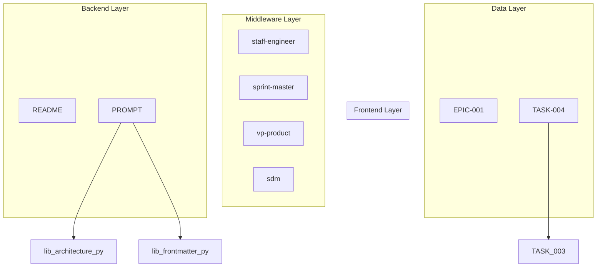

# PM System Architecture

> Auto-generated - DO NOT EDIT MANUALLY
>
> Regenerate with: `python scripts/architecture/generate.py`

## Organization Context

```
jadecli-ai/
├── pm/              ← This repository
│   ├── agents/      # AI agent definitions
│   ├── entities/    # Work item hierarchy
│   ├── lib/         # Shared code
│   └── ...
└── (future repos)
```

## System Layers

| Layer | Purpose | Components |
|-------|---------|------------|
| **Frontend** | Documentation, UI | 0 |
| **Middleware** | Agents, orchestration | 4 |
| **Backend** | Scripts, tests, lib | 2 |
| **Data** | Entities, index | 2 |

## Component Diagram



## Components by Layer

### Frontend (0)

| Component | Type | Version | Status |
|-----------|------|---------|--------|

### Middleware (4)

| Component | Type | Version | Status |
|-----------|------|---------|--------|
| staff-engineer | doc | 0.0.0 | unknown |
| sprint-master | doc | 0.0.0 | unknown |
| vp-product | doc | 0.0.0 | unknown |
| sdm | doc | 0.0.0 | unknown |

### Backend (2)

| Component | Type | Version | Status |
|-----------|------|---------|--------|
| README | library | 1.0.0 | active |
| PROMPT | doc | 1.0.0 | active |

### Data (2)

| Component | Type | Version | Status |
|-----------|------|---------|--------|
| EPIC-001 | epic | 1.2.0 | in_progress |
| TASK-004 | task | 1.0.1 | in_progress |

## Dependency Flow

```
Entities (Data) → Agents (Middleware) → Tests/Scripts (Backend) → Docs (Frontend)
```

## Interactive Visualization

Open `ARCHITECTURE.html` in a browser for interactive exploration.

## Updating

This file is auto-generated on every PR merge via GitHub Actions.

Manual regeneration:
```bash
python scripts/architecture/generate.py
```
